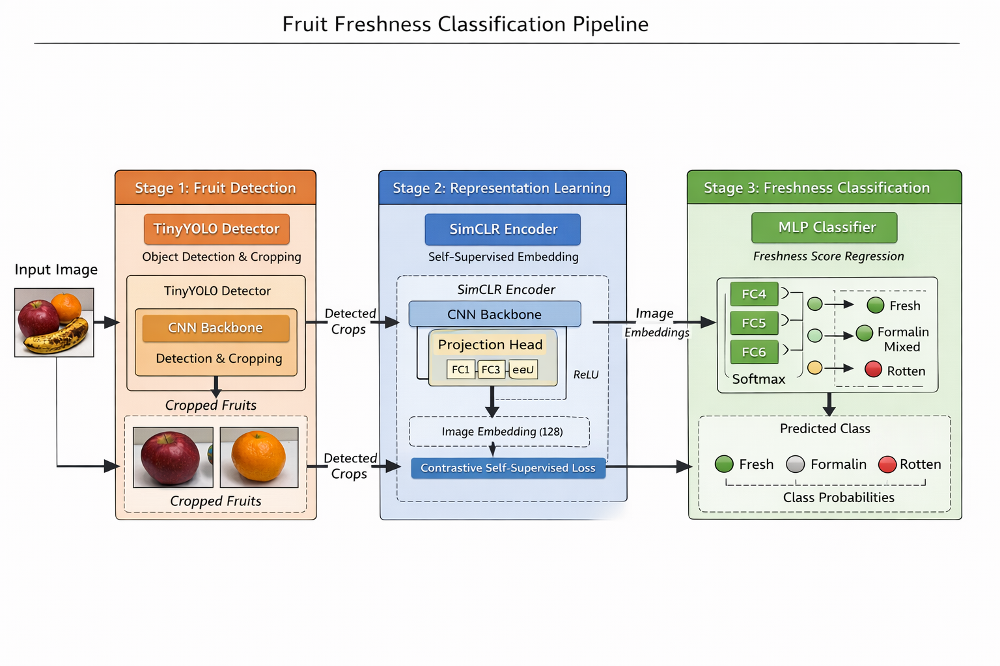

# FruitNet: Self-Supervised Fruit Freshness Classification

FruitNet is a computer vision pipeline for **automatic fruit quality assessment** using **object detection, self-supervised representation learning, and classification**.

The system predicts **three fruit conditions**:

* **Fresh**
* **Formalin Mixed**
* **Rotten**

The design focuses on **label-efficient learning**, using **Self-Supervised Learning (SSL)** to learn strong visual features from fruit images before training a classifier.

---

# Architecture

The pipeline consists of **three major stages**:

1. Fruit Detection and Cropping
2. Representation Learning using Self-Supervised Learning
3. Fruit Condition Classification

---

# System Pipeline

## 1. Fruit Detection (TinyYOLO)

The first stage identifies fruits in an image using a **TinyYOLO object detection model**.

Instead of processing the entire image, the detector:

* locates fruits using bounding boxes
* crops the detected fruit regions
* removes background noise

This step ensures that downstream models focus **only on fruit features such as color, texture, and surface defects**.

Output of this stage:

* Cropped fruit images used for representation learning.

---

## 2. Representation Learning using SimCLR (Self-Supervised Learning)

To avoid heavy reliance on labeled datasets, FruitNet uses **SimCLR**, a contrastive self-supervised learning framework.

Instead of labels, the model learns representations by comparing **different augmented views of the same image**.

### Training Process

Each fruit image is transformed into **two augmented versions** using techniques such as:

* random cropping
* color jitter
* horizontal flipping
* brightness variation

Both views are passed through a **CNN encoder network** that generates feature embeddings.

A **projection head** maps these embeddings into a representation space where:

* embeddings from the same fruit are **pulled closer**
* embeddings from different fruits are **pushed apart**

This contrastive learning objective allows the model to learn **visual structure and texture patterns related to fruit quality** without explicit labels.

Output of this stage:

* A trained **embedding encoder** capable of extracting meaningful fruit representations.

---

## 3. Fruit Condition Classification

Once the encoder is trained, it is used to generate embeddings for fruit images.

These embeddings are passed to a **Multi-Layer Perceptron (MLP) classifier** that predicts one of three fruit conditions:

* **Fresh** → healthy fruit
* **Formalin Mixed** → chemically treated fruit
* **Rotten** → spoiled fruit

The classifier outputs **class probabilities using Softmax**.

---

# Dataset Preparation

A custom dataset pipeline was created to support the architecture.

### Data Collection

Fruit images were gathered from publicly available datasets such as **FruitVision** and other fruit image sources.

### Data Preparation Pipeline

1. Raw images were collected.
2. TinyYOLO detected fruits in the images.
3. Detected fruits were **cropped automatically**.
4. Cropped fruit images were used for **self-supervised training**.
5. Labeled images were used for **training the final classifier**.

This approach enables the model to learn useful visual features even when labeled data is limited.

---

# Model Components

FruitNet consists of three primary components.

### TinyYOLO Detector

Detects fruit regions within images and generates cropped inputs.

### SimCLR Encoder

Learns fruit feature embeddings using contrastive self-supervised learning.

### MLP Classifier

Predicts fruit condition classes using learned embeddings.

---

# Key Features

* Self-Supervised Learning for label-efficient training
* Modular architecture separating detection, representation learning, and classification
* Automated fruit cropping using object detection
* Three-class fruit quality prediction (Fresh, Formalin Mixed, Rotten)

---

# Potential Applications

FruitNet can be applied in several real-world scenarios:

* automated fruit quality inspection
* food safety monitoring
* agricultural supply chain quality control
* smart grocery inventory systems
* food waste reduction

---

# Technologies Used

* Python
* PyTorch
* TinyYOLO
* SimCLR
* OpenCV
* Self-Supervised Learning
* Deep Learning for Computer Vision

